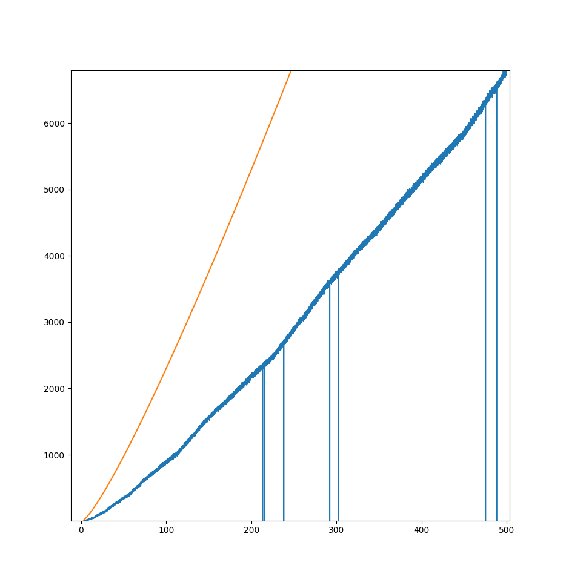

# push_swap

Push Swap is sorting algorithm project within the 42's paris school.
the goal is to sort integers contained in a LIFO stack using only one more LIFO a stack and a limited set of operation :

- sa	swap first two elements of stack A
- sb	swap first two elements of stack B
- ss	sa and sb at the same time
- pa	pops the first elememt on B and puts it on top of A
- pb	pops the first elememt on A and puts it on top of B
- ra	rotates stuck A up by one
- rb	rotates stuck B up by one
- rr	rotates both A and B up by one
- rra	rotates stuck A down by one
- rrb	rotates stuck B down by one
- rrr	rotates both A and B down by one

## My solution :

### Efficiency
-  3 Numbers  	Average:	1	Max:	2	Min:	0
-  5 numbers  	Average:	8	Max:	10	Min:	7
-  10 numbers 	Average:	31	Max:	34	Min:	28
-  100 numbers 	Average:	888	Max:	915	Min:	853
-  500 numbers  	Average:	6794	Max:	6833	Min:	6731

### Algorithm 